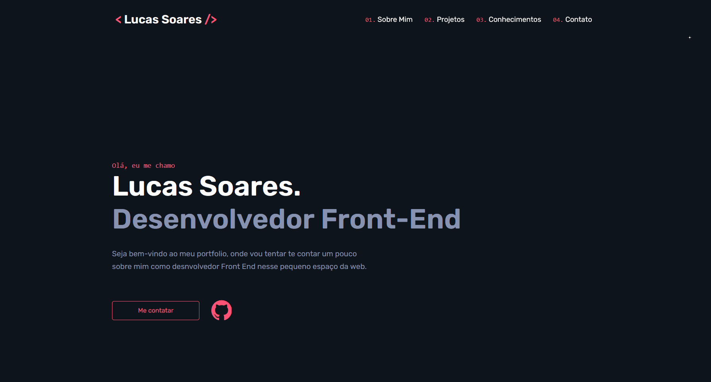

<h1 align="center">
    Meu Portfólio
</h1>

<h4 align="center"> 
	Concluído 🚀
</h4>

## 🎨 Layout

O layout do projeto:

### Web

  

### Mobile

  

---
 

## 💻 Sobre o projeto

Meu portfólio pessoal.

---
 

## 🛠 Tecnologias

As seguintes ferramentas foram usadas na construção do projeto:

-   **[HTML5](https://github.com/topics/html5)**
-   **[CSS3](https://github.com/topics/css)**
-   **[JAVASCRIPT](https://github.com/topics/javascript)**
---
 

## 🚀 Como testar o projeto

-   Você pode testar o projeto aqui: **[LucasSoaresDev](https://lucassoares.vercel.app)**
---
